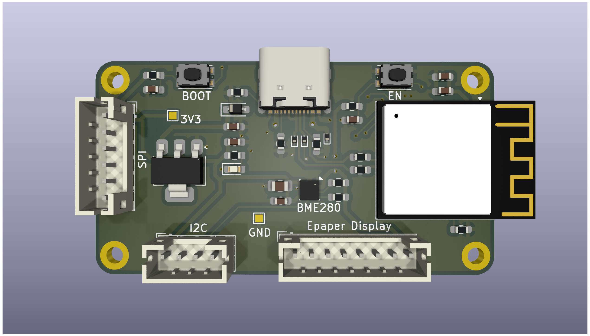
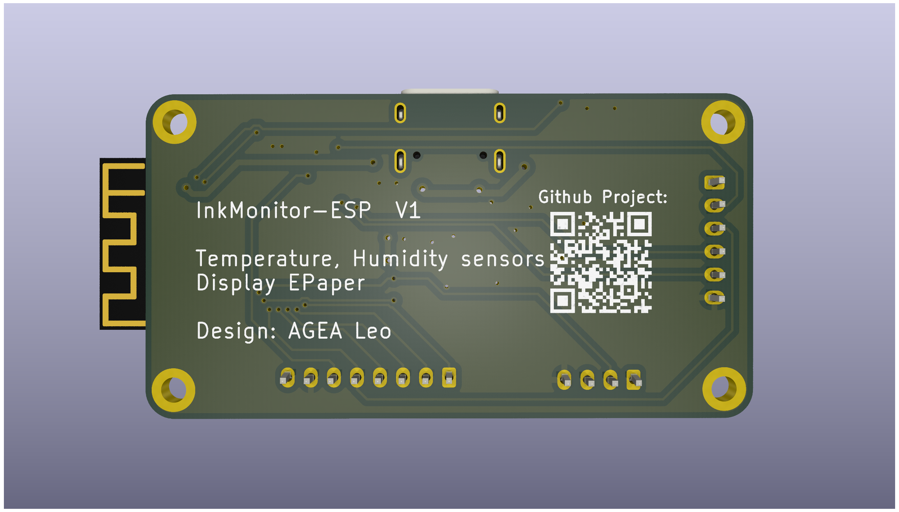

# InkMonitor-ESP

InkMonitor-ESP is a lightweight temperature and humidity monitoring device built around an ESP microcontroller and an e‑paper display. This repository contains the hardware design files (KiCad) for the PCB and supporting assets.

## Highlights

- Low‑power ESP‑based monitoring platform
- E‑paper display for always‑on status with minimal power draw
- KiCad project files, BOM export, and board backups included

## Repository contents

- [PCB/](PCB/) — KiCad project, board/schematic, BOM, CAD assets, and exports
- [changelog.md](changelog.md) — project changes

## Hardware overview

The design targets a compact ESP‑based module (ESP32‑S3 class) paired with a temperature/humidity sensor and a small e‑paper display. The exact parts and footprints are defined in the KiCad files.

If you want to review or edit the design, open the KiCad project file:

- [PCB/InkMonitor-ESP.kicad_pro](PCB/InkMonitor-ESP.kicad_pro)

## Renders

1. Open the project file: [PCB/InkMonitor-ESP.kicad_pro](PCB/InkMonitor-ESP.kicad_pro).
2. Review the schematic: [PCB/InkMonitor-ESP.kicad_sch](PCB/InkMonitor-ESP.kicad_sch).
3. Review the PCB layout: [PCB/InkMonitor-ESP.kicad_pcb](PCB/InkMonitor-ESP.kicad_pcb).

## Firmware

WIP

## License

See [LICENSE](LICENSE).
